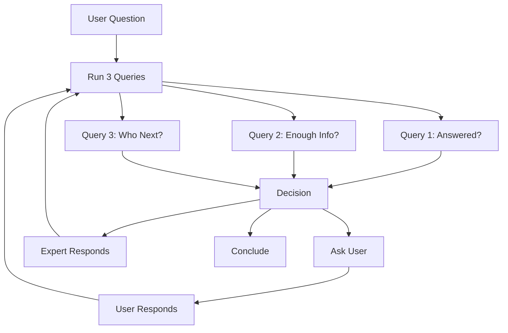
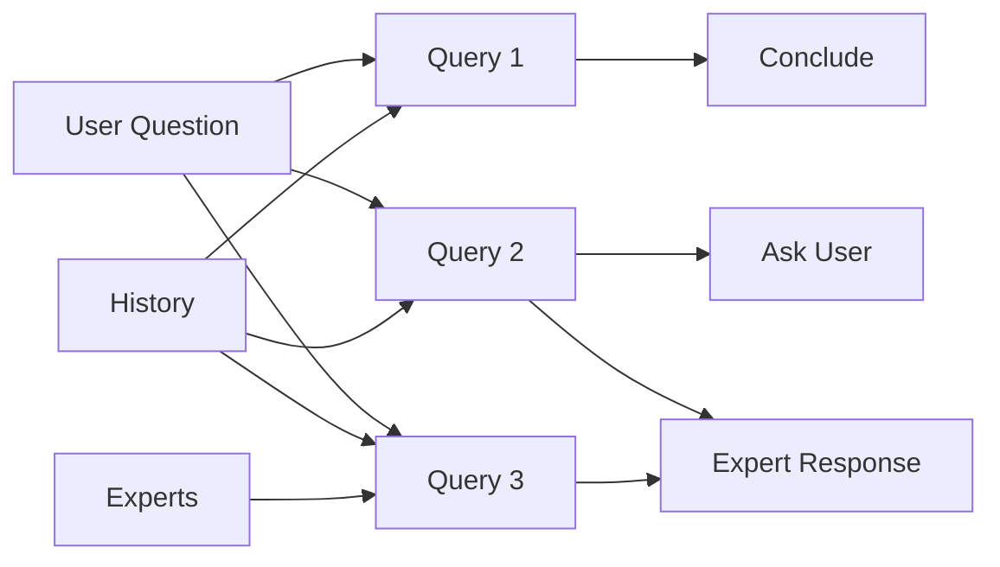

# Panel of Experts - Agentic Loop (2-Step Problem Approach)

# Example Question
i currently use react and django/python  and my manager wants to replace this with nextjs, help me debate him.

## System Overview
This diagram shows the new 2-step agentic loop with parallel categorization queries.



## Detailed 2-Step Process

### Step 1: Parallel Categorization Queries

The system runs 3 LLM queries in parallel to categorize the current state:

#### Query 1: Question Resolution Assessment
- **Question**: "Is the user's question answered?"
- **Skip Condition**: First execution per user message
- **Input**: Current conversation history, user's original question
- **Output**: Boolean (true/false) + confidence score (0-1)
- **Purpose**: Determine if we've sufficiently addressed the user's question

#### Query 2: Information Sufficiency Assessment
- **Question**: "Do we have enough information to engage the experts, or should we ask a clarifying question to the user?"
- **Input**: User's question, conversation context, expert capabilities
- **Output**: Boolean (sufficient/insufficient) + specific missing information
- **Purpose**: Determine if we need to ask the user for more context

#### Query 3: Expert Selection
- **Question**: "Given these descriptions of experts, including who answered last time, who should answer next?"
- **Input**: Expert descriptions, conversation history, last responder, question context
- **Output**: Selected expert ID + reasoning
- **Purpose**: Choose the most appropriate expert for the current context

### Step 2: Action Execution

Based on the categorization results, execute one of three actions:

#### Action A: Request Clarification
- **Trigger**: Query 2 returns "insufficient information"
- **Action**: Moderator asks user for specific missing information
- **Flow**: Wait for user response, then re-run Step 1

#### Action B: Expert Response
- **Trigger**: Query 2 returns "sufficient information" AND Query 1 returns "not answered"
- **Action**: Selected expert (from Query 3) provides response
- **Flow**: After response, re-run Step 1

#### Action C: Conclude Discussion
- **Trigger**: Query 1 returns "answered" with high confidence
- **Action**: Moderator provides summary/conclusion
- **Flow**: End discussion, wait for new user question

## System Architecture



## Implementation Considerations

### Parallel Query Execution
- All 3 queries run simultaneously for efficiency
- Each query is independent and can use different LLM models if needed
- Results are combined to determine the next action

### State Tracking
- Track which expert responded last to avoid repetition
- Maintain conversation history for context
- Track question resolution confidence over time

### Query Optimization
- Query 1 can be cached/skipped on first iteration
- Query 2 can be simplified if conversation history is short
- Query 3 can use expert response patterns for better selection

### Error Handling
- If any query fails, fall back to default behavior
- Retry logic for transient failures
- Graceful degradation if expert selection fails

## Key Benefits

1. **Efficiency**: Parallel queries reduce latency
2. **Clarity**: Clear separation between categorization and action
3. **Flexibility**: Each query can be optimized independently
4. **Scalability**: Easy to add new categorization queries
5. **Debugging**: Clear decision points for troubleshooting

## Example Flow

```
User: "How do I implement authentication in React?"

Step 1 (Parallel):
- Query 1: "Is question answered?" → false (first time)
- Query 2: "Enough info?" → true (clear question)
- Query 3: "Who next?" → "Frontend Expert"

Step 2:
- Action B: Frontend Expert responds
- Re-run Step 1

Step 1 (Parallel):
- Query 1: "Is question answered?" → false (needs more detail)
- Query 2: "Enough info?" → true
- Query 3: "Who next?" → "Security Expert"

Step 2:
- Action B: Security Expert responds
- Re-run Step 1

Step 1 (Parallel):
- Query 1: "Is question answered?" → true (comprehensive answer)
- Query 2: "Enough info?" → true
- Query 3: "Who next?" → (not needed)

Step 2:
- Action C: Moderator concludes with summary
```
